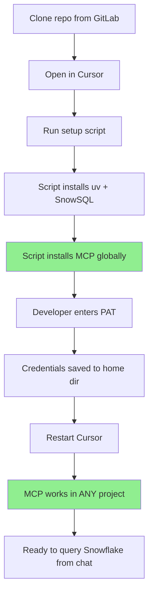

# Snowflake Development Environment Setup

This guide walks you through setting up Snowflake tools for Cursor IDE:
- **MCP Server**: Query Snowflake directly from Cursor chat
- **SnowSQL**: Command-line interface for Snowflake

Both tools share the same connection profiles for easy environment switching.

## Onboarding Flow



### What Gets Set Up

| Item | Location | Scope |
|------|----------|-------|
| **MCP Server** | `~/.cursor/mcp.json` | Global - works everywhere |
| **MCP Credentials** | `~/.snowflake/connections.toml` | Global |
| **MCP Tools** | `~/.mcp/snowflake-tools.yaml` | Global |
| **SnowSQL** | `~/.snowsql/config` | Global |
| **Team Rules** | `.cursor/rules/` | Project-level |
| **Commands** | `.cursor/commands/` | Project-level |

## Prerequisites

- [ ] **Homebrew** (macOS only) - [Install Homebrew](https://brew.sh/)
  ```bash
  /bin/bash -c "$(curl -fsSL https://raw.githubusercontent.com/Homebrew/install/HEAD/install.sh)"
  ```
- [ ] Snowflake account access
- [ ] Programmatic Access Token (PAT) from Snowflake
- [ ] Cursor IDE installed

## Step 1: Install uv (Python Package Manager)

The MCP server uses `uvx` to run. Install `uv` using the standalone installer:

```bash
curl -LsSf https://astral.sh/uv/install.sh | sh
```

After installation, restart your terminal or run:
```bash
source $HOME/.local/bin/env
```

Verify installation:
```bash
uvx --version
```

## Step 2: Create a Programmatic Access Token (PAT)

1. Log in to your Snowflake account at `https://app.snowflake.com`
2. Click your **username** in the bottom-left corner
3. Select **My Profile**
4. Scroll to **Programmatic Access Tokens** section
5. Click **Generate New Token**
6. Give it a name (e.g., "Cursor MCP")
7. **Important**: Select the role that has access to your data (e.g., `ACCOUNTADMIN`)
8. Copy the generated token - you'll need it in the next step

> ⚠️ **Note**: PATs do not evaluate secondary roles. Select a single role that has access to all services and objects you need.

## Step 3: Configure Snowflake Connection

Create the Snowflake configuration directory and file:

```bash
mkdir -p ~/.snowflake
```

Copy the template from this repo:
```bash
cp .snowflake/connections.toml.template ~/.snowflake/connections.toml
```

Edit `~/.snowflake/connections.toml` with your credentials:

```toml
[default]
account = "<YOUR_ACCOUNT_IDENTIFIER>"
user = "<YOUR_USERNAME>"
password = "<YOUR_PAT_TOKEN>"
warehouse = "SANDBOX_WH"
database = "SANDBOX_DB"
schema = "SANDBOX_SCHEMA"
role = "ACCOUNTADMIN"
```

## Step 4: Configure MCP Tools

Copy the MCP tools configuration:

```bash
mkdir -p ~/.mcp
cp .mcp/snowflake-tools.yaml ~/.mcp/snowflake-tools.yaml
```

This enables:
- **Object Manager**: Create, drop, and manage Snowflake objects
- **Query Manager**: Execute SQL queries
- **Semantic Manager**: Work with Semantic Views

## Step 5: Restart Cursor

The MCP server is configured **globally** by the setup script, so it works in any project.

1. Close and reopen Cursor (or reload the window)
2. The `snowflake-default` MCP server will be available in **all projects**
3. You should see Snowflake tools available in chat

> **Note**: MCP is installed globally to `~/.cursor/mcp.json`. You can query Snowflake from any directory!

## Step 6: Verify MCP Setup

1. Open a new chat in Cursor
2. The Snowflake MCP server should appear in your available tools
3. Try a simple query: "Show me all tables in the SANDBOX_DB database"

---

## SnowSQL Setup (Optional)

SnowSQL is the command-line client for Snowflake. It uses matching connection profiles so you can switch environments consistently.

### Install SnowSQL

**macOS (Homebrew):**
```bash
brew install --cask snowflake-snowsql
```

Add the alias to your shell (for zsh):
```bash
echo 'alias snowsql=/Applications/SnowSQL.app/Contents/MacOS/snowsql' >> ~/.zshrc
source ~/.zshrc
```

Verify installation:
```bash
snowsql -v
```

### Configure SnowSQL

Copy the template from this repo:
```bash
mkdir -p ~/.snowsql
cp .snowsql/config.template ~/.snowsql/config
chmod 700 ~/.snowsql/config
```

Edit `~/.snowsql/config` with your credentials (same as MCP):

```ini
[connections.default]
accountname = <YOUR_ACCOUNT_IDENTIFIER>
username = <YOUR_USERNAME>
password = <YOUR_PAT_TOKEN>
warehousename = SANDBOX_WH
dbname = SANDBOX_DB
schemaname = SANDBOX_SCHEMA
rolename = ACCOUNTADMIN
```

### Connect with SnowSQL

```bash
# Connect using default profile
snowsql -c default

# Connect to staging
snowsql -c staging

# Connect to production
snowsql -c prod
```

---

## Switching Environments

Both MCP and SnowSQL use matching connection names:

| Environment | MCP Server (Cursor) | SnowSQL Command |
|-------------|---------------------|-----------------|
| Development | `snowflake-default` | `snowsql -c default` |
| Staging | `snowflake-staging` | `snowsql -c staging` |
| Production | `snowflake-prod` | `snowsql -c prod` |

---

## Multi-Account Configuration

You can configure multiple Snowflake accounts and switch between them in Cursor.

### Step 1: Add Multiple Connections

Edit `~/.snowflake/connections.toml` to add multiple account sections:

```toml
[default]
account = "<YOUR_ACCOUNT_IDENTIFIER>"
user = "your_username"
password = "your_pat_token"
warehouse = "SANDBOX_WH"
database = "SANDBOX_DB"
schema = "SANDBOX_SCHEMA"
role = "ACCOUNTADMIN"

[staging]
account = "SFSENORTHAMERICA-STAGING_ACCT"
user = "your_username"
password = "your_staging_pat"
warehouse = "STAGING_WH"
database = "STAGING_DB"
schema = "PUBLIC"
role = "DATA_ENGINEER"

[prod]
account = "SFSENORTHAMERICA-PROD_ACCT"
user = "your_username"
password = "your_prod_pat"
warehouse = "PROD_WH"
database = "PROD_DB"
schema = "PUBLIC"
role = "ANALYST"
```

### Step 2: Add Multiple MCP Servers in Cursor

Configure separate MCP servers for each account in Cursor Settings → MCP:

```json
{
  "mcpServers": {
    "snowflake-dev": {
      "command": "${userHome}/.local/bin/uvx",
      "args": [
        "snowflake-labs-mcp",
        "--service-config-file", "${userHome}/.mcp/snowflake-tools.yaml",
        "--connection-name", "default"
      ]
    },
    "snowflake-staging": {
      "command": "${userHome}/.local/bin/uvx",
      "args": [
        "snowflake-labs-mcp",
        "--service-config-file", "${userHome}/.mcp/snowflake-tools.yaml",
        "--connection-name", "staging"
      ]
    },
    "snowflake-prod": {
      "command": "${userHome}/.local/bin/uvx",
      "args": [
        "snowflake-labs-mcp",
        "--service-config-file", "${userHome}/.mcp/snowflake-tools.yaml",
        "--connection-name", "prod"
      ]
    }
  }
}
```

### Step 3: Use in Chat

Each MCP server will appear separately in Cursor. Select the appropriate one for your task:
- Use `snowflake-dev` for development work
- Use `snowflake-staging` for testing
- Use `snowflake-prod` for production queries (recommend read-only role)

---

## Security Best Practice: Read-Only Role

For maximum protection against accidental data modification, create a dedicated read-only role in Snowflake.

### Why Use a Read-Only Role?

| Protection Layer | What It Prevents |
|------------------|------------------|
| **MCP SQL Permissions** | Blocks DROP/INSERT/UPDATE at MCP level |
| **Snowflake RBAC** | Blocks operations at database level (defense in depth) |
| **Time Travel** | Recovery if something slips through |

### Create a Read-Only Role

Run this SQL as `ACCOUNTADMIN` or a role with `CREATE ROLE` privilege:

```sql
-- =============================================================================
-- CREATE READ-ONLY ROLE FOR MCP/CURSOR USERS
-- =============================================================================

-- Step 1: Create the role
CREATE ROLE IF NOT EXISTS MCP_READONLY;
COMMENT ON ROLE MCP_READONLY IS 'Read-only role for MCP/Cursor Snowflake access';

-- Step 2: Grant warehouse usage (required for queries)
GRANT USAGE ON WAREHOUSE SANDBOX_WH TO ROLE MCP_READONLY;

-- Step 3: Grant database access
GRANT USAGE ON DATABASE SANDBOX_DB TO ROLE MCP_READONLY;

-- Step 4: Grant schema access
GRANT USAGE ON SCHEMA SANDBOX_DB.SANDBOX_SCHEMA TO ROLE MCP_READONLY;

-- Step 5: Grant SELECT on existing tables/views
GRANT SELECT ON ALL TABLES IN SCHEMA SANDBOX_DB.SANDBOX_SCHEMA TO ROLE MCP_READONLY;
GRANT SELECT ON ALL VIEWS IN SCHEMA SANDBOX_DB.SANDBOX_SCHEMA TO ROLE MCP_READONLY;

-- Step 6: Grant SELECT on future tables/views (auto-apply to new objects)
GRANT SELECT ON FUTURE TABLES IN SCHEMA SANDBOX_DB.SANDBOX_SCHEMA TO ROLE MCP_READONLY;
GRANT SELECT ON FUTURE VIEWS IN SCHEMA SANDBOX_DB.SANDBOX_SCHEMA TO ROLE MCP_READONLY;

-- Step 7: Assign role to users
GRANT ROLE MCP_READONLY TO USER <YOUR_USERNAME>;

-- Optional: Make it the user's default role
ALTER USER <YOUR_USERNAME> SET DEFAULT_ROLE = MCP_READONLY;
```

### Add Multiple Schemas

To grant access to additional schemas:

```sql
-- Grant access to another schema
GRANT USAGE ON SCHEMA SANDBOX_DB.ANOTHER_SCHEMA TO ROLE MCP_READONLY;
GRANT SELECT ON ALL TABLES IN SCHEMA SANDBOX_DB.ANOTHER_SCHEMA TO ROLE MCP_READONLY;
GRANT SELECT ON ALL VIEWS IN SCHEMA SANDBOX_DB.ANOTHER_SCHEMA TO ROLE MCP_READONLY;
GRANT SELECT ON FUTURE TABLES IN SCHEMA SANDBOX_DB.ANOTHER_SCHEMA TO ROLE MCP_READONLY;
GRANT SELECT ON FUTURE VIEWS IN SCHEMA SANDBOX_DB.ANOTHER_SCHEMA TO ROLE MCP_READONLY;
```

### Update Your Configuration

After creating the role, update your connection config:

```toml
# In ~/.snowflake/connections.toml
[default]
role = "MCP_READONLY"  # Use the new read-only role
```

### Verify Permissions

Test that the role is truly read-only:

```sql
-- These should work
USE ROLE MCP_READONLY;
SELECT * FROM SANDBOX_DB.SANDBOX_SCHEMA.some_table LIMIT 10;
DESCRIBE TABLE SANDBOX_DB.SANDBOX_SCHEMA.some_table;

-- These should FAIL with permission errors
DROP TABLE SANDBOX_DB.SANDBOX_SCHEMA.some_table;  -- Should fail
INSERT INTO SANDBOX_DB.SANDBOX_SCHEMA.some_table VALUES (...);  -- Should fail
DELETE FROM SANDBOX_DB.SANDBOX_SCHEMA.some_table;  -- Should fail
```

---

## Troubleshooting

### MFA Authentication Error
```
MFA authentication is required, but none of your current MFA methods are supported
```
**Solution**: Use a Programmatic Access Token (PAT), not your regular password.

### 404 Not Found Error
```
404 Not Found: post <account>.snowflakecomputing.com
```
**Solution**: Check your account identifier format. It should be the full identifier (e.g., `<YOUR_ACCOUNT_IDENTIFIER>`).

### SSL Error with Underscores
If your account has underscores, try replacing them with dashes in the account identifier.

### View Cursor MCP Logs
1. Open the **Output** panel in Cursor
2. Select **Cursor MCP** from the dropdown
3. View real-time logs

### Test with MCP Inspector
```bash
npx @modelcontextprotocol/inspector uvx snowflake-labs-mcp \
  --service-config-file ~/.mcp/snowflake-tools.yaml \
  --connection-name default
```

---

## Quick Reference

| File | Location | Purpose |
|------|----------|---------|
| `mcp.json` | `~/.cursor/` | **Global** MCP config (works in any project) |
| `connections.toml` | `~/.snowflake/` | MCP credentials (TOML format) |
| `config` | `~/.snowsql/` | SnowSQL credentials (INI format) |
| `snowflake-tools.yaml` | `~/.mcp/` | Snowflake MCP server configuration |

> **Project-level override**: If a project has `.cursor/mcp.json`, it takes precedence over global config.

### Cursor Config Variables

| Variable | Description |
|----------|-------------|
| `${userHome}` | Path to your home folder |
| `${env:NAME}` | Environment variable value |
| `${workspaceFolder}` | Project root directory |

## PAT Rotation

Programmatic Access Tokens (PATs) expire and must be rotated periodically.

### Check PAT Expiration

1. Log in to Snowflake at `https://app.snowflake.com`
2. Click your **username** in the bottom-left corner
3. Select **My Profile**
4. Scroll to **Programmatic Access Tokens** section
5. Check the expiration date for your token

### Signs Your PAT Has Expired

- Authentication errors in Cursor MCP logs
- "Invalid credentials" or "Authentication failed" in SnowSQL
- MCP server fails to start

### Rotate Your PAT

1. **Generate a new PAT** in Snowflake UI (My Profile → Programmatic Access Tokens)
2. **Update MCP credentials** in `~/.snowflake/connections.toml`:
   ```toml
   password = "<NEW_PAT_TOKEN>"
   ```
3. **Update SnowSQL credentials** in `~/.snowsql/config`:
   ```ini
   password = <NEW_PAT_TOKEN>
   ```
4. **Restart Cursor** to reload the MCP server

### Best Practice

Set a calendar reminder **1 week before** your PAT expiration date to avoid disruption.

---

## Resources

- [Official Snowflake MCP Server](https://github.com/Snowflake-Labs/mcp)
- [SnowSQL Installation](https://docs.snowflake.com/en/user-guide/snowsql-install-config)
- [SnowSQL Configuration](https://docs.snowflake.com/en/user-guide/snowsql-config)
- [SnowSQL Usage](https://docs.snowflake.com/en/user-guide/snowsql-start)
- [Snowflake Python Connector](https://docs.snowflake.com/en/developer-guide/python-connector/python-connector-connect)
- [MCP Protocol](https://modelcontextprotocol.io/introduction)
- [uv Documentation](https://docs.astral.sh/uv/)
