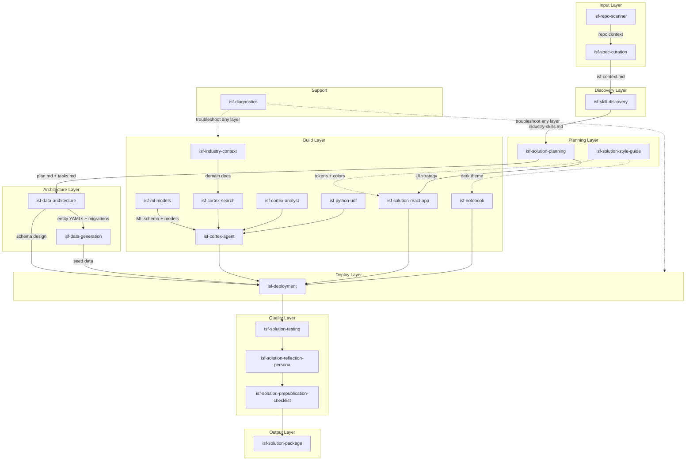

# ISF Skills — Comprehensive Workflow Status

Last updated: 2026-03-02

## Workflow Overview

The ISF Solution Generation Engine is a 22-skill workflow that takes customer requirements and produces a fully deployed Snowflake solution with presentation materials.



## The Pipeline

### Phase 1: Input

The user provides requirements through one of three paths:

| Path | Skill | Input | Output |
|------|-------|-------|--------|
| A: Document Import | `isf-spec-curation` | JSON, PDF, pasted text | Populated `isf-context.md` |
| B: Conversational | `isf-spec-curation` | Interview-style Q&A | Populated `isf-context.md` |
| C: Repo Analysis | `isf-repo-scanner` → `isf-spec-curation` | GitHub URL or local path | Populated `isf-context.md` |

**Key artifact**: `isf-context.md` — a structured YAML specification with T1 (user-provided), T2 (recommended), and T3 (skill-generated) fields covering customer context, stakeholders, requirements, architecture, and implementation.

### Phase 1.5: Discovery

After spec curation establishes the industry, the pipeline scans for domain-specific skills in the user's environment.

| Skill | Input | Output |
|-------|-------|--------|
| `isf-skill-discovery` | `isf-context.md` (industry field) | `specs/{solution}/industry-skills.md` |

If no industry skills are found, an empty artifact is produced and the pipeline continues normally. Discovered skills are presented to the user for approval and then consumed by planning to map domain expertise into the architecture.

### Phase 2: Planning

| Skill | Input | Output |
|-------|-------|--------|
| `isf-solution-planning` | `isf-context.md`, `industry-skills.md` | `plan.md`, `tasks.md`, scaffolded project directory |
| `isf-solution-style-guide` | — (cross-cutting) | Design tokens, color palette, accessibility rules |

**Key artifact**: Scaffolded project following the ISF standard structure with Makefile, schemachange, SPCS deployment.

### Phase 3: Architecture & Data

| Skill | Input | Output |
|-------|-------|--------|
| `isf-data-architecture` | `isf-context.md` data_model, entity YAMLs | schemachange migrations in `src/database/migrations/` |
| `isf-data-generation` | Entity YAMLs + behavior profiles | Seed Parquet files in `src/data_engine/output/` |

**Key artifacts**: Versioned DDL migrations and pre-generated seed data (seed=42, committed to repo).

### Phase 4: Build

| Skill | Input | Output |
|-------|-------|--------|
| `isf-cortex-analyst` | DATA_MART views | `src/database/cortex/semantic_model.yaml` |
| `isf-cortex-search` | Documents/text | `src/database/cortex/search_service.sql` |
| `isf-python-udf` | Business logic requirements | `src/database/functions/*.sql` |
| `isf-cortex-agent` | Analyst + Search + UDFs | `src/database/cortex/agent.sql` |
| `isf-solution-react-app` | `plan.md` UI strategy + style guide tokens | `src/ui/` + `api/` (6 component templates, 3 backend patterns, performance-first) |
| `isf-notebook` | ML requirements | `notebooks/*.ipynb` |

**Key artifacts**: Working application code, Cortex objects, and notebooks.

### Phase 5: Deploy

| Skill | Input | Output |
|-------|-------|--------|
| `isf-deployment` | Migrations, seed data, app code, SPCS config | Running SPCS service |

**Stages**: `deploy/setup.sql` → schemachange → seed data load → SPCS (Docker build, push, service create).

### Phase 6: Quality

| Skill | Input | Output | Order |
|-------|-------|--------|-------|
| `isf-solution-testing` | Deployed solution | 8-layer test results | First |
| `isf-solution-reflection-persona` | App + isf-context personas | STAR journey audit | Second |
| `isf-solution-prepublication-checklist` | Full project | Release decision (Ship/No Ship/Conditional) | Third |

### Phase 7: Package

| Skill | Input | Output |
|-------|-------|--------|
| `isf-solution-package` | Completed solution + isf-context | Presentation page, architecture SVGs, blog, LinkedIn blurb, slides, video script |

### Support (Any Phase)

| Skill | Purpose |
|-------|---------|
| `isf-diagnostics` | 8-layer troubleshooting: connection → roles → warehouse → objects → Cortex → SPCS → project structure → migrations |

## Complete Skill Inventory

### 22 Skills

| # | Skill | Category | Chains To |
|---|-------|----------|-----------|
| 0 | `isf-solution-engine` | Orchestrator | All skills (entry point) |
| 1 | `isf-spec-curation` | Input | → `isf-skill-discovery` |
| 2 | `isf-repo-scanner` | Input | → `isf-spec-curation` |
| 3 | `isf-skill-discovery` | Discovery | → `isf-solution-planning` |
| 4 | `isf-solution-planning` | Planning | → `isf-data-architecture` |
| 5 | `isf-solution-style-guide` | Planning (cross-cutting) | (loaded by app skills) |
| 6 | `isf-data-architecture` | Architecture | → `isf-data-generation` |
| 7 | `isf-data-generation` | Architecture | → Cortex skills (parallel) |
| 8 | `isf-industry-context` | Architecture (RAG) | → `isf-cortex-search` |
| 9 | `isf-cortex-analyst` | Build (Cortex) | → `isf-cortex-agent` (parallel) |
| 10 | `isf-cortex-search` | Build (Cortex) | → `isf-cortex-agent` (parallel) |
| 11 | `isf-python-udf` | Build (Cortex) | → `isf-cortex-agent` (parallel) |
| 12 | `isf-ml-models` | Build (ML) | → `isf-cortex-agent` (parallel) |
| 13 | `isf-cortex-agent` | Build (Cortex) | → `isf-solution-react-app` |
| 14 | `isf-solution-react-app` | Build (App) | → `isf-deployment` |
| 15 | `isf-notebook` | Build (ML infra) | → `isf-deployment` |
| 16 | `isf-deployment` | Deploy | → `isf-solution-testing` |
| 17 | `isf-solution-testing` | Quality | → `isf-solution-reflection-persona` |
| 18 | `isf-solution-reflection-persona` | Quality | → `isf-solution-prepublication-checklist` |
| 19 | `isf-solution-prepublication-checklist` | Quality | → `isf-solution-package` |
| 20 | `isf-solution-package` | Output | (pipeline complete) |
| 21 | `isf-diagnostics` | Support | (any phase) |

## Key Artifacts Across the Pipeline

```
specs/{solution}/
├── isf-context.md               # From isf-spec-curation (the contract)
├── industry-skills.md           # From isf-skill-discovery (Phase 1.5)
├── plan.md                      # From isf-solution-planning
├── tasks.md                     # From isf-solution-planning
└── repomix-output.xml           # From isf-repo-scanner (if Path C)

{project}/                        # Scaffolded by isf-solution-planning
├── Makefile                     # Build orchestration
├── .env.example                 # Connection config template
├── deploy/
│   ├── setup.sql                # One-time infra provisioning
│   └── spcs/
│       ├── Dockerfile           # Multi-stage React+FastAPI
│       └── service-spec.yaml    # SPCS service config
├── src/
│   ├── ui/                      # React + TypeScript + Tailwind
│   ├── database/
│   │   ├── migrations/          # schemachange versioned DDL
│   │   ├── functions/           # Python UDFs
│   │   ├── procs/               # Stored procedures
│   │   ├── roles/               # RBAC config
│   │   └── cortex/
│   │       ├── agent.sql
│   │       ├── semantic_model.yaml
│   │       └── search_service.sql
│   └── data_engine/
│       ├── generators/          # Generation scripts
│       ├── loaders/             # COPY INTO scripts
│       ├── specs/               # Data shape specs
│       └── output/              # Pre-generated Parquet files + manifest.json
├── api/                         # FastAPI backend
├── models/                      # Semantic models
├── docs/                        # Architecture specs
├── tests/                       # UI + API + data tests
├── notebooks/                   # Snowflake Notebooks (if ML)
└── solution_presentation/       # Package deliverables
```

## Design Decisions

| Decision | Rationale |
|----------|-----------|
| `isf-context.md` is the contract | Structured YAML with T1/T2/T3 tiers replaces flat markdown specs |
| React+FastAPI is the only frontend | Consistent pipeline, SPCS deployment, SSE streaming, eliminates framework mismatch |
| YAML entity files define schemas | 34MB → ~2,000 lines; fits in LLM context; includes generation rules |
| Parquet over CSV for seed data | Type-safe, compressed (Snappy), faster Snowflake loads via MATCH_BY_COLUMN_NAME, no quoting issues |
| No Snowflake dependency for skills | YAML is source of truth; works offline |
| schemachange for migrations | Versioned DDL, CI/CD compatible |
| Makefile replaces shell scripts | `make deploy`, `make test` — simpler orchestration |
| `setup.sql` for provisioning | One-time SQL, no Terraform/Python provisioning |
| `npx repomix` for repo scanning | No global install; only needs Node.js |
| Entity contribution saves locally | Repo contribution (feature branch + PR) planned for later |
| Skills are modular, not monolithic | Each skill has clear input/output; no nested sub-skills |
| References loaded selectively | Only load entity/pattern files relevant to the spec's industry |
| Hidden discovery is first-class | Data generation verifies the insight; testing validates it; persona reflection checks it's accessible |
| Dark theme is the default | Matches delta-irop quality bar; light theme available via archetype mapping in style guide |
| Industry skill discovery is first-class | Phase 1.5 scans environment for domain-specific skills before planning begins |
| Performance-first backend templates | Connection pool, persistent HTTP client, TTL cache, SSE dedup shipped as copy-in templates |
| Click-to-ask is mandated | Every metric and data point must be clickable to query the Cortex Agent |

## What's Not Built Yet

| Item | Status | Notes |
|------|--------|-------|
| Decision log sidecar | Designed (schema + DDL exist in old `skills/`) | Not wired into isf-skills; needs isf-context integration |
| Entity contribution to repo | Documented in isf-data-architecture | Git automation (branch + PR) not implemented |
| ISF ID catalog | Referenced throughout | No actual catalog of SOL-xxx, UC-xxx, PAIN-xxx values yet |
| CI/CD pipeline | `ci_test_cycle.sh` template exists | No GitHub Actions workflow file |
| Industry YAML files | 9 created | AME and GOV not yet created |
